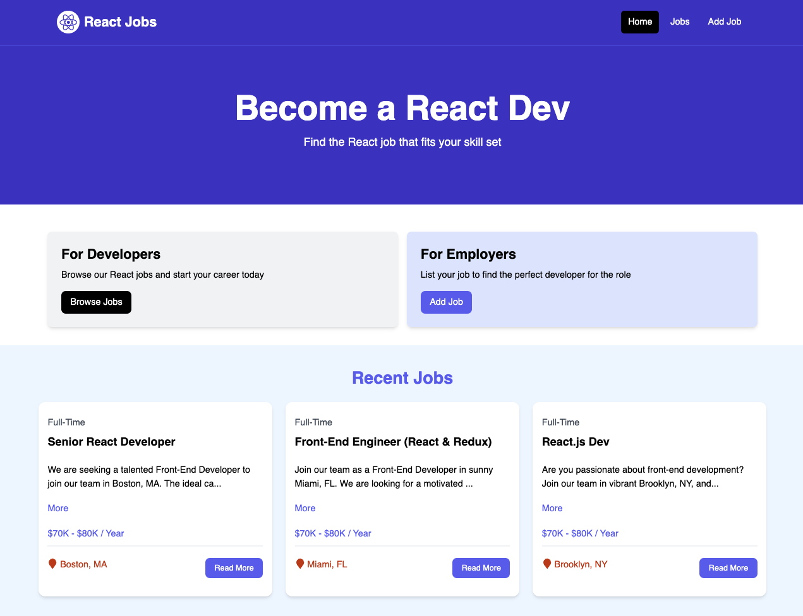

# React Job Website

This project is a job listing website built with a React frontend and a Node.js/Express/MongoDB backend. It's a full-stack MERN application that allows users to browse, add, edit, and delete job listings.

It was originally inspired by a YouTube tutorial by [Traversy Media](https://youtu.be/LDB4uaJ87e0) but has been extended with a custom backend.



## Features

- **React Frontend:** Built with Vite, using functional components and hooks.
- **Node.js & Express Backend:** A robust API for managing job data.
- **MongoDB Database:** Data persistence for job listings.
- **Full CRUD Functionality:** Create, Read, Update, and Delete jobs.
- **Responsive Design:** Styled with Tailwind CSS.

## Prerequisites

- Node.js and npm
- MongoDB (either a local instance or a cloud service like MongoDB Atlas)

## Installation and Setup

Follow these steps to run the project locally:

1. **Clone the repository:**
```bash
git clone https://github.com/Harshit-Soni78/React-Job-Website.git
cd React-Job-Website
```

### Run JSON Server

The server will run on http://localhost:8000

```bash
npm run server
```

### Run Vite Frontend

React will run on http://localhost:3000

```bash
npm run dev
```

### Build for Production

```bash
npm run build
```

### Preview Production Build

```bash
npm run preview
```
